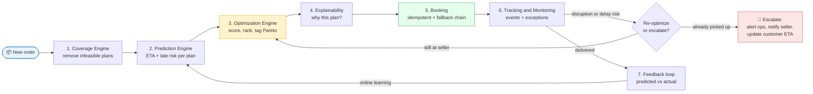
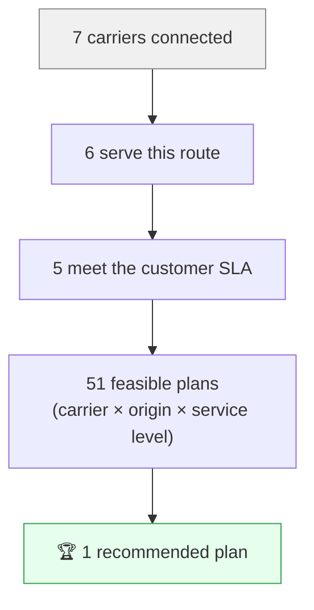
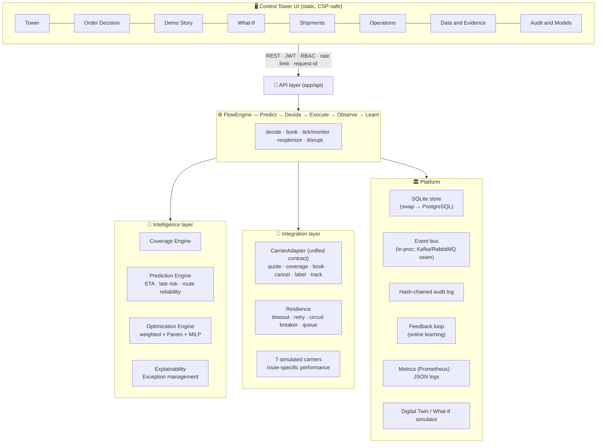
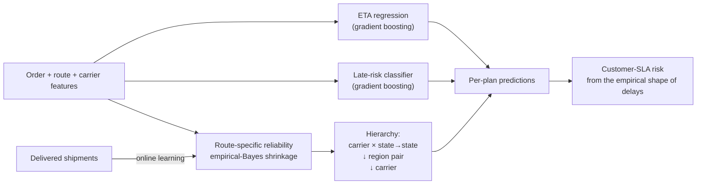
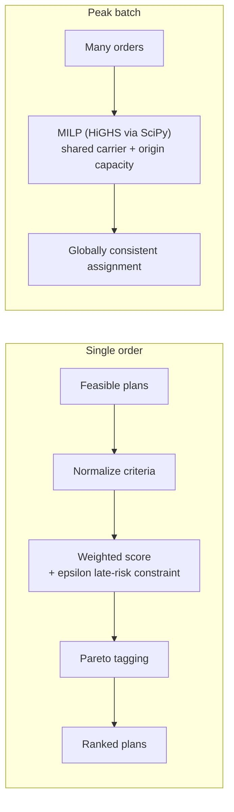
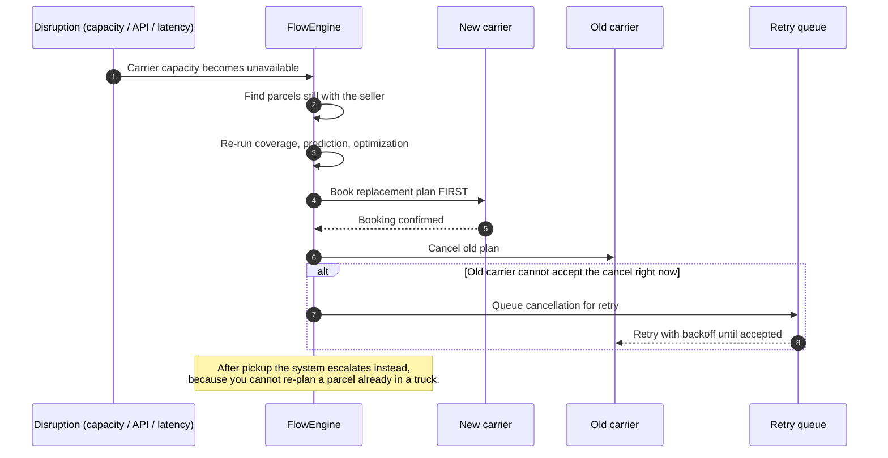
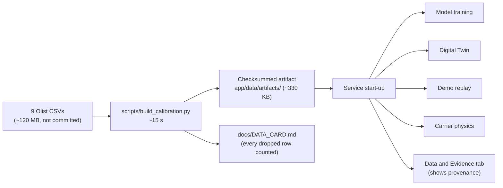
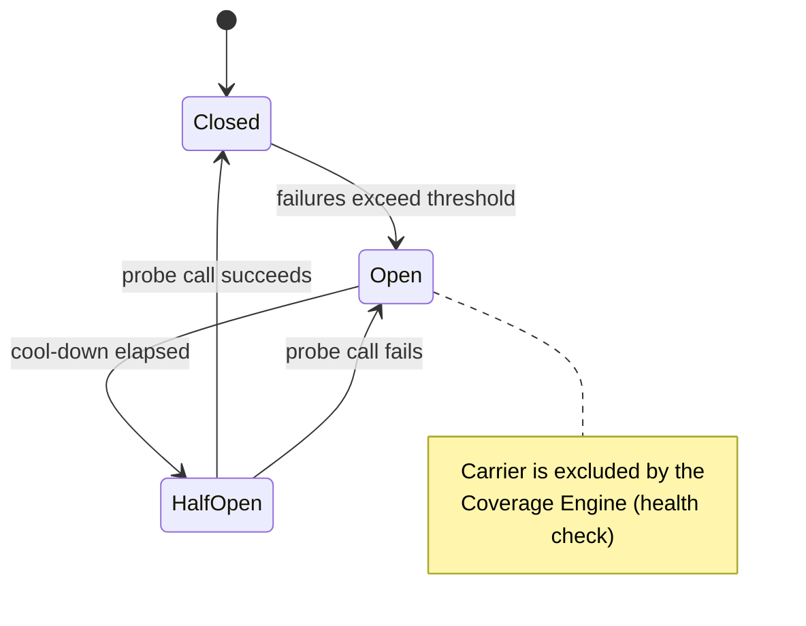
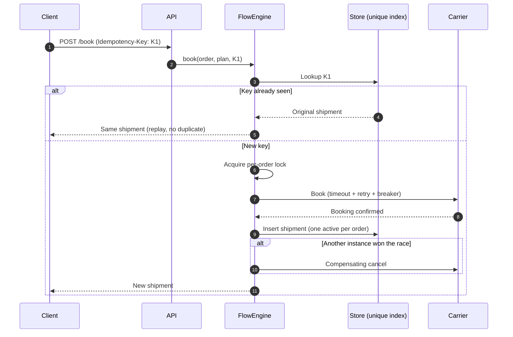
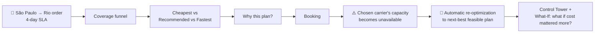

<div align="center">

# 🚚 Olist Flow

### Intelligent Logistics Optimization & Control Tower

**A real-time decision engine that selects, monitors, and re-optimizes the best fulfillment and carrier plan for every single order.**

> ### Machine learning **predicts** outcomes. Optimization **selects** actions.

</div>

---

## 📑 Table of Contents

1. [What is Olist Flow?](#-what-is-olist-flow)
2. [Why it exists — evidence from real data](#-why-it-exists--evidence-from-real-data)
3. [The life of one order](#-the-life-of-one-order)
4. [Architecture](#-architecture)
5. [Engines in detail](#-engines-in-detail)
6. [Real data integration](#-real-data-integration)
7. [Real-data benchmark](#-real-data-benchmark-what-real-orders-can-and-cannot-tell-us)
8. [Measured results (Digital Twin)](#-measured-results)
9. [Enterprise-grade quality](#-enterprise-grade-quality)
10. [The Control Tower UI](#-the-control-tower-ui)
11. [Quick start](#-quick-start)
12. [Project layout](#-project-layout)
13. [2-minute demo script](#-2-minute-demo-script)
14. [Honest limitations](#-honest-limitations)
15. [Roadmap](#-roadmap)
16. [ملخص بالعربي](#-ملخص-بالعربي)

---

## 🎯 What is Olist Flow?

Most logistics tools are **comparison tools**: they list carriers and prices and leave the thinking to a human.

**Olist Flow is a decision engine.** For every order, it answers a much harder question:

> *"Given the current state of the network, what is the best logistics decision — and **why**?"*

…and then it **keeps watching**. When conditions change (a carrier drops out, capacity runs out, a parcel gets stuck), it **re-decides automatically**.

### In one sentence

Olist Flow takes an order, throws away every plan that is impossible, predicts the delivery time and late-risk of each remaining plan, picks the best **(origin + carrier + service level)** combination under an adjustable business policy, explains its choice in plain language, books it safely (no duplicates, ever), tracks it, and re-plans if the world changes.

### What makes it different

| A comparison tool… | Olist Flow… |
|---|---|
| Lists carriers and prices | **Decides** origin + carrier + service level *together* |
| Shows a price at one moment | Re-evaluates **continuously** as conditions change |
| Says "cheapest" or "fastest" | Balances cost, ETA, late risk, reliability and capacity with a **configurable policy** |
| Gives a black-box answer | Produces **head-to-head explanations** for every decision |
| Stops at the quote | Covers the full loop: **Predict → Decide → Execute → Observe → Learn** |
| Breaks when a carrier API fails | Uses timeouts, retries, circuit breakers, fallback chains and a retry queue |

---

## 🔍 Why it exists — evidence from real data

Findings from the discovery analysis (`HVIA_Olist_Business_Discovery.ipynb`) on the public Olist e-commerce dataset:

| Finding | What Olist Flow does about it |
|---|---|
| **64%** of shipments cross state lines, at **~75% higher freight** | Optimizes **origin + carrier + service level** together (multi-node inventory), not just the carrier |
| Late deliveries crush reviews: score drops **4.31 → 2.27** | Predicts per-route late risk, treats the customer SLA as a **constraint**, escalates and re-plans **before** the customer complains |
| Lateness comes in **bursts** (Black Friday 2017 **and** Feb–Mar 2018) | `peak_season` policy + capacity-aware batch **MILP** + what-if stress tests, with the observed months as presets |

---

## 🧭 The life of one order



### Step by step

1. **Coverage** — Of the connected carriers, which can *actually* serve this order? Pickup area, service area, weight, restricted goods, capacity, SLA and carrier health are all checked. Every rejection is recorded with its reason.
2. **Prediction** — For each feasible plan, gradient-boosting models predict the **ETA** and the **late-risk**, using route-specific carrier reliability.
3. **Optimization** — Plans are scored on normalized criteria (cost, ETA, late risk, reliability, capacity) under the chosen policy. Pareto-optimal plans are tagged.
4. **Explanation** — The winner is compared head-to-head with the alternatives: *"39% cheaper than X, 6 pts lower late risk than Y."*
5. **Booking** — The plan is booked with an `Idempotency-Key`. If the first choice fails, the system walks down the ranked fallback chain.
6. **Monitoring** — Shipment events stream in; the exception engine classifies severity and recommends interventions.
7. **Learning** — Every delivered shipment updates route reliability and calibration online.

### The coverage funnel (real example output)



---

## 🏗 Architecture



### Design principles

- **One code path.** The Digital Twin runs synthetic orders through the *same* coverage, prediction and optimization code as production decisions. What you simulate is what you run.
- **Seams, not rewrites.** A real carrier is one new adapter class. PostgreSQL and Kafka/RabbitMQ are interface swaps.
- **Explain everything.** Nothing in the UI says "AI chose B" — every choice has a reason trail.
- **Honesty over hype.** Every metric is labeled as real, simulated, or calibrated. See [Honest limitations](#-honest-limitations).

---

## 🔬 Engines in detail

### 1. Coverage Engine — *"What is even possible?"*

Removes infeasible plans **before** optimization, and keeps every rejection reason for the explanation layer.

| Constraint checked | Example rejection |
|---|---|
| Pickup area | Carrier does not collect from this origin |
| Service area | Carrier does not deliver to this destination |
| Weight / volume | Parcel exceeds carrier limits |
| Restricted goods | Category not accepted |
| Capacity | Carrier or origin is at its daily limit |
| Customer SLA | Predicted delivery would miss the promise |
| Carrier health | Circuit breaker is open / API is degraded |

### 2. Prediction Engine — *"What will probably happen?"*



- **ETA regression** and **late-risk classifier** use gradient boosting.
- **Route-specific reliability** uses empirical-Bayes shrinkage across a hierarchy (`carrier × state→state → region pair → carrier`), so sparse routes borrow strength from broader groups instead of overfitting.
- **Customer-SLA risk** is derived from the empirical shape of delay distributions.
- It **learns online** from delivered shipments.

### 3. Optimization Engine — *"What is the best decision?"*

Configurable multi-objective scoring over normalized criteria: **cost · ETA · late risk · reliability · capacity**.

| Policy profile | Intent |
|---|---|
| 💰 **Economy** | Minimize freight cost |
| ⚡ **Express** | Minimize delivery time |
| 🛡 **Reliability** | Minimize late risk, favor proven carriers |
| 🎄 **Peak Season** | Capacity-aware; protects SLAs when the network is stressed |
| ⚖️ **Balanced** | Sensible default across all criteria |

On top of profiles, you get **custom weights**, **seller priority**, an **epsilon-constraint on late risk**, and **Pareto-front tagging** so you can see which plans are non-dominated.



> For peak load, a **MILP** assigns a *whole batch* at once under shared carrier/origin capacity — so the first orders in the queue don't steal all the fast-carrier capacity from the rest. Endpoint: `POST /v1/batch/optimize`.

### 4. Explainable decisions — *"Why this plan?"*

Every decision ships with:

- **Head-to-head deltas** — e.g. *"39% cheaper than X, 6 pts lower late risk than Y"*
- **SLA check** and **capacity** status
- **Pareto status** of the chosen plan
- The **list of excluded plans with reasons**

### 5. Re-optimization — *"The world changed. Now what?"*



**Key safety property:** the replacement is booked **before** the old plan is cancelled, so a parcel is never left without a plan.

### 6. Exception management — *"Something is going wrong."*

Severity levels: **Normal → Warning → High risk → Critical**

| Trigger | Examples |
|---|---|
| Pickup | Pickup missed |
| Network | Stuck at hub · tracking stalled |
| Time | ETA exceeded · high delay probability |
| Delivery | Delivery failed |
| Systems | Carrier API down · capacity exceeded |

**Automated response:** alert operations → notify seller → update customer ETA → recommend an intervention → re-optimize (when possible).

### 7. Digital Twin / What-If — *"Test the policy before you change it."*

Synthetic orders run through the **same** coverage / prediction / optimization code, against carrier ground truth. Built-in scenarios:

- Policy what-ifs (*"what if cost mattered more?"*)
- Carrier outage
- 2× volume
- Black-Friday peak
- A new fulfillment partner in Rio

---

## 🗄 Real data integration

The nine Olist CSVs are distilled by `scripts/build_calibration.py` into a small, **checksummed** artifact (`app/data/artifacts/`, ~330 KB) that the service loads at start.

- The raw files (~120 MB) are **not needed at runtime** and are **not committed**.
- Without the artifact, the platform falls back to its original synthetic physics and says so (`/v1/data/evidence` → `"active": false`).

```bash
pip install -r requirements-data.txt
python scripts/build_calibration.py --data-dir path/to/olist_csvs     # ~15 s → artifact + docs/DATA_CARD.md
```



### Real measurements (95,195 delivered single-seller orders, 2016-09-15 → 2018-08-29)

| Measurement | Value |
|---|---|
| Orders crossing a state line | **64.0%** |
| Freight premium, cross-state vs same-state | **+74.9%** per order (+76.8% per item) |
| Late vs the customer promise (calendar-day definition) | **6.9%**, median 7 days late when late |
| Review score, on-time → late | **4.31 → 2.27** |
| Promised delivery vs median actual | 23.22 d vs 10.25 d (the promise is **2.26×** the median) |
| Seller handling / carrier transit (median) | 2.21 d / 7.11 d (p90 18.96 d) |

### How the real data is used

- **Origin/destination shares** come from real orders.
- A **20,000-order bootstrap** of real orders (joint state pair, month, weight, volume, value, category, promise) feeds model training, the Digital Twin and demo replay.
- **Per-route carrier-transit medians, route late-risk and zip-to-zip distances** shape every simulated carrier.
- **Observed monthly lateness** replaces the hand-made peak penalty.
- **Carrier tariffs** are scaled per destination region to the observed Olist freight.
- The **review penalty** is measured, not assumed.
- *Operations → Seed demo data* **replays real Olist orders** through the real decide → book → track pipeline (`source=synthetic` keeps the old generator).

### What the real data changed (honest before/after, Digital Twin, 1,000 orders)

The old synthetic physics was **optimistic**. Real Olist routes are much slower than the simulator assumed (the flow-weighted median route needed a **2.569×** transit correction):

| | Synthetic physics | Real-calibrated |
|---|---|---|
| Balanced baseline average delivery | 1.94 d | **4.78 d** |
| Cost of "always cheapest" (delivery time) | +1.14 d | **+3.72 d** |

Two findings were invisible before: lateness is **bursty** (Nov-2017 and Feb–Mar 2018, not just Black Friday), and the customer promise is **padded 2.26×**.

---

## 📊 Real-data benchmark: what real orders can and cannot tell us

Carrier-agnostic models trained on real orders **before 2018-06-01** (76,908) and scored on **2018-06-01 → 2018-08-29** (18,287) — a chronological hold-out.

| Metric | Model | Baseline |
|---|---|---|
| ETA mean absolute error | **3.49 d** | 12.62 d (Olist's own estimate) · 4.97 d (constant median) |
| Late-risk ROC-AUC | 0.655 | 0.478 (route history) · 0.50 (chance) |
| Brier score | 0.0366 | 0.0369 (constant) |
| Late rate in the riskiest decile | 7.7% (**2.1× lift**) | 3.7% overall |

- ✅ **ETA is the strong, reliable result.** Olist's own estimate is 12.07 days too conservative on the hold-out.
- ⚠️ **Late-risk is weak on real orders.** AUC 0.655, and the Brier score barely beats a constant. Route history is *below chance* (0.478) because the Feb–Mar 2018 burst that dominates the training window does not repeat.
- ℹ️ Olist has **no carrier id**, so carrier-level accuracy cannot be measured from this data at all.

---

## 📈 Measured results

Reproduce with:

```bash
python scripts/measure.py                      # calibrated physics
python scripts/measure.py --physics synthetic  # original simulator
```

> **⚠️ Read this first.** These metrics are for the **simulated carriers** operating on **real route physics**. They show that the pipeline works and how policies trade off. They are **not** real-world carrier accuracy: Olist has no carrier id, and the only fully real accuracy numbers are in the benchmark above.

### Prediction (simulated carriers, hold-out 4,800 shipments)

| Metric | Model | Baseline |
|---|---|---|
| ETA mean absolute error | **1.377 days** | 1.616 days (carrier's own promise) |
| Late-risk ROC-AUC (vs the carrier's own promise) | 0.743 | 0.50 |
| Late rate in the riskiest decile | 43.1% (**3.1× lift**) | 14.2% overall |

### Latency

| Test | Result |
|---|---|
| 199 real-shaped orders, full pipeline, 7 carriers × up to 3 origins | decision **p50 12.7 ms** · p95 17.6 ms |
| 1,000-order Digital Twin run | ≈ 2.5 s |

### Policy trade-offs (Digital Twin, 1,000 orders)

Baseline: Balanced June — **R$14.58** avg freight · **8.2%** expected late · **4.78 d** · estimated review **4.143**

| Scenario | Avg freight | Late rate | Avg delivery | Unserved |
|---|---|---|---|---|
| Naive policy: always the cheapest carrier | -41.7% | +8.4 pts | +3.72 d | 0 |
| Cost priority (Economy mode) | -40.3% | +5.8 pts | +3.30 d | 0 |
| Reliability priority | +5.1% | -0.1 pts | +0.17 d | 0 |
| Top carrier RapidoSul unavailable | -11.2% | +1.8 pts | +1.19 d | 0 |
| 2× order volume | -9.0% | +12.0 pts | +1.49 d | 211 |
| Black-Friday peak (Nov, 2.5× volume, Peak Season mode) | -9.5% | +28.8 pts | +1.32 d | 689 |
| Feb–Mar 2018 disruption replay (real lateness spike, Reliability mode) | +10.4% | +3.1 pts | +0.28 d | 0 |

These are the trade-offs a manager sees **before** changing policy.

**How to read the table**
- Scenario rows with a month (Black Friday, Feb–Mar 2018) include the **month effect as well as the policy**.
- Avg freight *falls* in the volume scenarios because scarce fast-carrier capacity forces work onto cheaper, slower carriers — always read it together with the **late rate** and **unserved** columns.
- The Twin's freight is for the *chosen* carrier and is **not** a savings claim against the real Olist average (R$22.47).

---

## 🏢 Enterprise-grade quality

| Concern | Implementation |
|---|---|
| **Reliability** | Per-call timeout · retry with backoff + jitter (transient errors only) · circuit breaker (closed / open / half-open) · fallback chain across ranked plans · persistent retry queue for bookings and cancellations |
| **Idempotency** | `Idempotency-Key` required for booking · replays return the original shipment · one active shipment per order (DB unique index) · per-order lock · **compensating carrier cancel** if another instance wins a race · tested with 12 concurrent submits |
| **Events** | `ShipmentCreated, PickedUp, ArrivedAtHub, OutForDelivery, Delivered, DeliveryFailed, ExceptionRaised, ActionTriggered, PlanReoptimized…` · persisted + fan-out · `Transport` protocol is the Kafka/RabbitMQ seam |
| **Observability** | JSON logs with correlation id · Prometheus-format `/metrics` (API latency, carrier calls/failures, breaker opens, optimizer latency, booking failures, re-optimizations) · `/health/live` · `/health/ready` |
| **Security** | JWT (HS256, exp, required claims) · RBAC (Admin, Operations Manager, Seller, Analyst — sellers see only their own orders/shipments) · scrypt password hashing · token-bucket rate limiting (stricter on login) · CSP + security headers · secrets from env · refuses to boot in production with the dev secret · no user enumeration by timing |
| **Audit** | Every decision (policy, weights, selected plan, cost, ETA, risk), booking, re-plan, policy change, disruption and login is recorded in a **hash-chained** log · `/v1/audit/verify` detects any edit |
| **Feedback loop** | Predicted vs actual ETA/risk per delivered shipment → online reliability update, calibration gap, per-carrier bias (Audit & Models tab) |

### Circuit breaker states



### Idempotent booking



---

## 🖥 The Control Tower UI

| Tab | What you do there |
|---|---|
| 🗼 **Tower** | Live KPIs, shipments by status, open exceptions, carrier health |
| 🧠 **Order Decision** | Submit an order, see the coverage funnel, ranked plans and the explanation |
| 🎬 **Demo Story** | A guided walkthrough — every step calls the real API |
| 🔮 **What-If** | Change policy or inject a scenario, compare against baseline in the Digital Twin |
| 📦 **Shipments** | Track every shipment, its events and exceptions |
| 🛠 **Operations** | Seed demo data (real Olist replay or synthetic), trigger disruptions |
| 🗂 **Data & Evidence** | Real-data measurements with full provenance and artifact integrity |
| 🧾 **Audit & Models** | Hash-chained audit log, feedback loop, calibration and per-carrier bias |

**KPIs are business KPIs first** — freight cost per order, late rate, on-time %, median delivery time, estimated review score, SLA breaches, savings — with technical KPIs beside them (optimization latency, booking failures, ETA MAE, precision/recall/lift).

---

## 🚀 Quick start

No Docker needed.

```bash
pip install -r requirements.txt
python -m app.main            # http://localhost:8000   (models train in ~1 s on start)
python -m pytest -q           # 65 tests
```

Open <http://localhost:8000> and sign in with one of the development accounts:

| Username | Password | Role | Access |
|---|---|---|---|
| `admin` | `olistflow-dev` | Admin | Full access |
| `ops` | `olistflow-dev` | Operations Manager | Operations, shipments, disruptions |
| `analyst` | `olistflow-dev` | Analyst | Dashboards, data and evidence |
| `seller` | `olistflow-dev` | Seller | Only their own orders/shipments (scoped to seller `S001`) |

> These are **development-only** credentials. In production the dev secret is rejected and the server refuses to start (see below).

Then go to **Operations → Seed demo data**, open **Control Tower**, or walk through **Demo Story**.

- **API docs:** <http://localhost:8000/docs>
- **Production:** set `OLISTFLOW_ENV=production` and a real `OLISTFLOW_JWT_SECRET` (the server **refuses to start** otherwise). See `.env.example`.

---

## 🧱 Project layout

```
app/
├── integration/   # carrier adapters, resilience, simulated world
├── intelligence/  # coverage, prediction, optimizer, explain, exceptions
├── services/      # engine, store, events, feedback, twin, analytics, seed
├── data/          # real-data ETL, calibration, evidence
├── api/           # routes, security
└── ui/            # Control Tower dashboard
scripts/           # build_calibration.py, measure.py
tests/             # 65 tests
docs/              # DATA_CARD.md (generated)
```

---

## 🎬 2-minute demo script

The **Demo Story** tab runs this flow (all steps call the real API):



---

## ⚠️ Honest limitations

We would rather you trust the numbers than be impressed by them.

- **Olist has no carrier identifier, so carrier behavior is still simulated.** Real data now constrains the *market* the carriers operate in (routes, distances, transit times, route risk, monthly lateness, freight level, parcel mix, customer promises), but carrier prices, speeds, reliability and capacity remain **illustrative**. The metrics under *Measured results* describe simulated carriers on real route physics, not real-world carrier accuracy. The only fully real accuracy figures are in the benchmark — and there, late-risk is weak.
- **The data is historical and partly unrepresentative.** It ends in Oct 2018; the customer promise in it is padded 2.26×; Feb–Mar 2018 was a network-wide disruption, so month penalties for those months are **stress scenarios, not a seasonal law**. Multi-seller orders (1,278) and undelivered orders are excluded (every drop is counted in `docs/DATA_CARD.md`).
- **The raw CSVs are not bundled** (licence and size); rebuild the artifact with `scripts/build_calibration.py`. The artifact is checksummed and its integrity is shown in the UI, but it is not signed.
- **Carriers are simulated** behind the production adapter contract (`integration/base.py`). A real carrier = one new adapter class; nothing else changes.
- **Single-node infrastructure.** SQLite is single-writer and the event bus is in-process — fine for one node and a demo; move to PostgreSQL and Kafka/RabbitMQ (interfaces are in place) for multi-instance deployment. The rate limiter is per-process. Login has rate limiting but no account lockout/MFA.
- **Greedy Digital Twin.** The twin assigns orders sequentially under live capacity; exact batch optimality is provided by the MILP endpoint (`POST /v1/batch/optimize`).
- **Not built:** geo-services/maps integration, order/payment system adapters, HTTPS termination (put it behind a reverse proxy), automatic policy tuning.

---

## 🗺 Roadmap

| Phase | Scope | Status |
|---|---|---|
| **Phase 1** | Orders, coverage, quotes, weighted optimization, booking, tracking, dashboard | ✅ Done |
| **Phase 2** | ETA / late-risk models, route reliability, alerts | ✅ Done |
| **Phase 3** | Multi-origin optimization, capacity constraints, Pareto / MILP, real-time re-optimization | ✅ Done |
| **Phase 4** | What-if, digital twin, control tower | ✅ Done |
| **Phase 4** | **Automatic policy tuning** | ⏳ Remaining |

---

## 🌍 ملخص بالعربي

منصة بتاخد الـorder، تستبعد الخيارات غير الممكنة، تتوقع الـETA وخطر التأخير لكل route، وبعدين الـoptimizer يختار أفضل (مخزن + شركة شحن + مستوى خدمة) حسب سياسة قابلة للتعديل، ويشرح ليه اختارها، وينفّذ الحجز بشكل آمن ضد التكرار، ولو الظروف اتغيرت (شركة وقعت/كابستي خلصت) بيعيد التخطيط تلقائيًا.

دلوقتي المشروع متدرّب ومعايَر على **95 ألف طلب حقيقي من Olist** (المسارات، زمن النقل، التأخير الشهري، سعر الشحن، الأوزان)، وفيه تاب "Data & Evidence" بيعرض الأرقام ومصدرها.

أهم حاجة بنقولها بصراحة: داتا Olist مفيهاش اسم شركة الشحن، فشركات الشحن لسه محاكاة فوق فيزياء مسارات حقيقية، ودقة توقع التأخير على الداتا الحقيقية ضعيفة، بينما دقة توقع وقت التوصيل ممتازة مقارنة بتقدير Olist نفسه.

---

<div align="center">

**Olist Flow** — *predict, decide, explain, execute, learn.*

</div>
